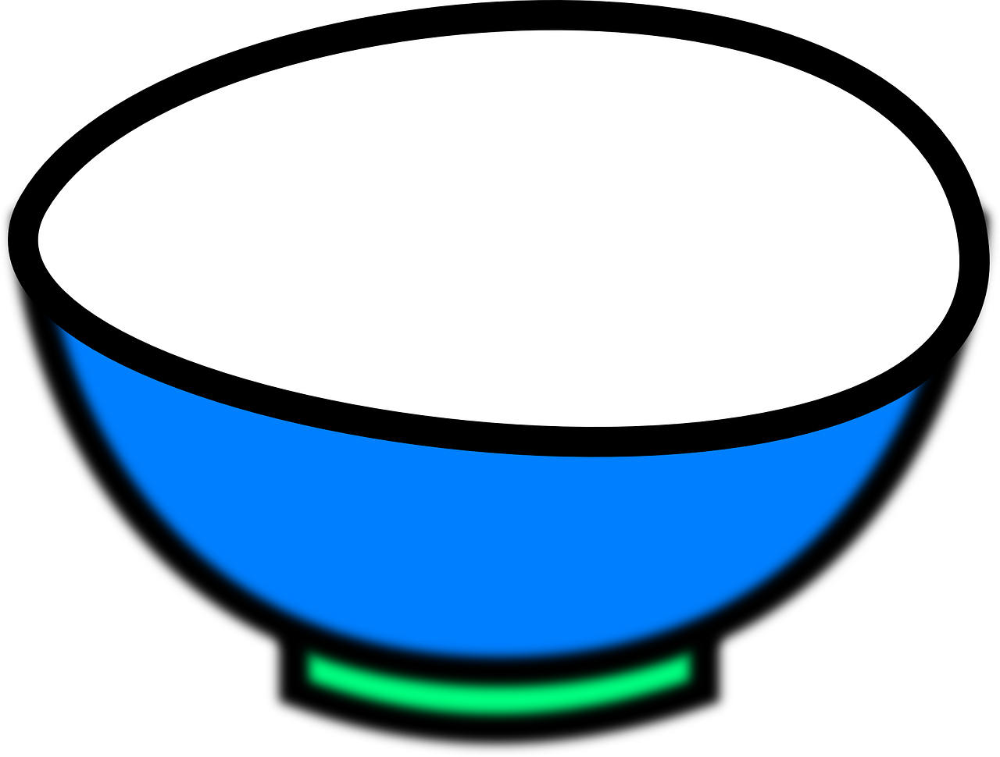
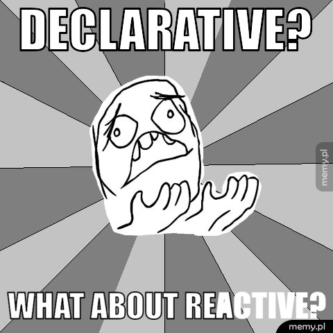
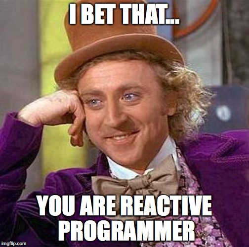
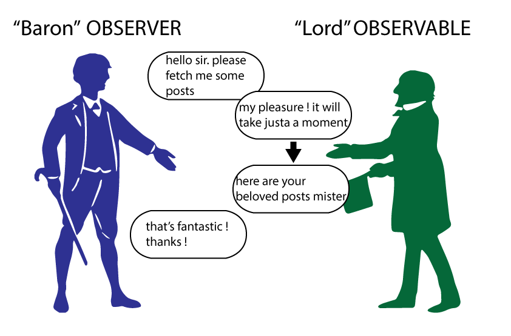
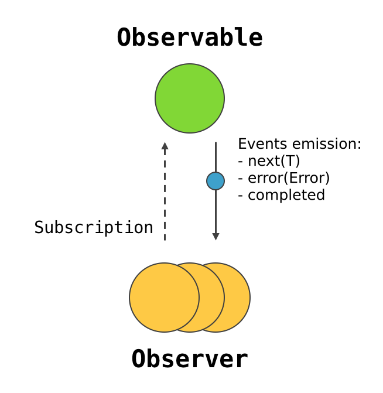
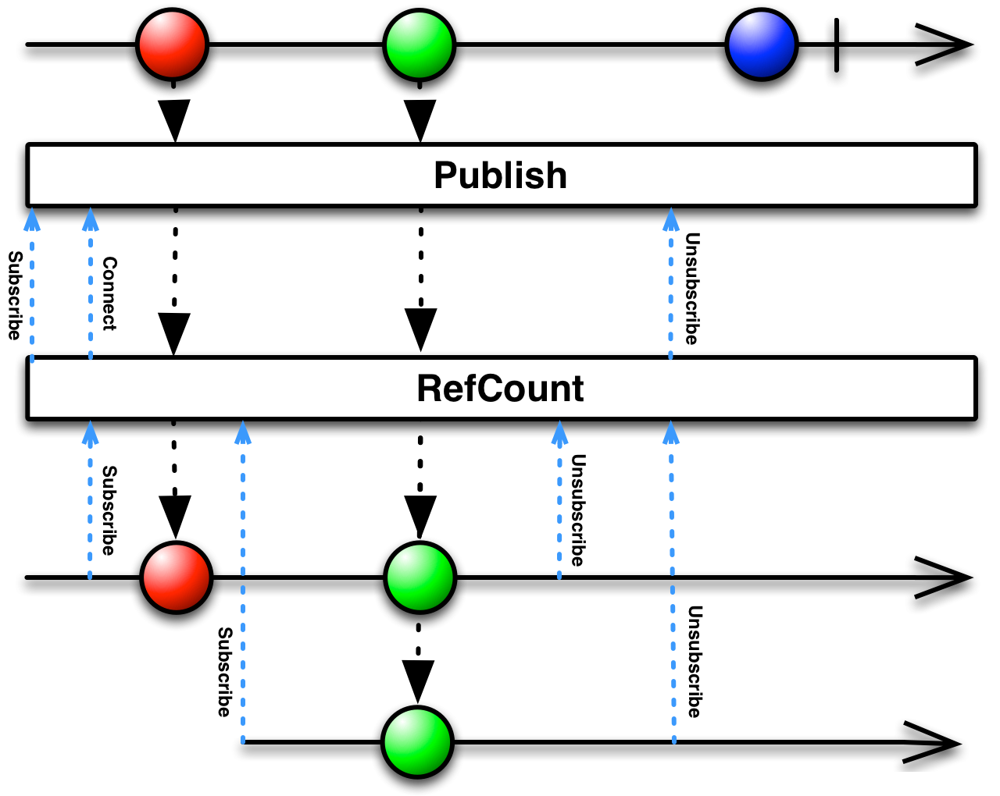

theme: Titillium, 1
autoscale: true
footer: EL Passion 2019

# [fit] **RxSwift**
# [fit] Workshops

---

## WI-FI

📶 `EL_Passion_Guest`
🔑 `passionateguest`

## URL do repozytorium

```
https://github.com/elpassion/RxSwift-workshops
```

---

# Agenda

1. Moduł I - wprowadzenie do Functional Reactive Programming i RxSwifta
2. Pizza 🍕
3. Moduł II - UI bindings in RxCocoa
4. Coffee break ☕
6. Moduł III - Reactive API calls

####\*Każdy moduł składa się z części **teoretycznej** i **praktycznej**.

---

# [fit] Moduł I
# [fit] Wprowadzenie do FRP i RxSwifta

---

# **Paradygmaty programowania**

1. Imperatywne
2. Deklaratywne
  * funkcyjne

^ Jedną z odmian programowania deklaratywnego jest programowanie funkcyjne.

---

# Programowanie **imperatywne** -
# opis instrukcji **JAK** coś wykonać.

^ 
• Prawdopodobnie każdy kto rozpoczynał przygodę z programowaniem zaczynał od pisania kodu imperatywnie.
• Paradygmat programowania, w którym programista opisuje instrukcje jedna po drugiej w celu osiągnięcia końcowego rezultatu. 

---

# [fit] Opis instrukcji **JAK** coś wykonać
1. Weź miskę .
2. Dosyp mąkę .
3. Dolej mleka .
4. Dodaj jajka .
5. Wymieszaj wszystko i smaż ciasto na patelni .

^ 
• Dobrym przykładem może być przepis na naleśniki z książki kucharskiej, w którym poszczególne punkty opisują co powinno zostać wykonane. 
• Kolejność tutaj ma ogromne znaczenie, zamieniając przykładowo punkt 1-wszy z 5-tym powoduje, że nie uzyskamy prawidłowego rezultatu.

---

# Programowanie **deklaratywne** - 
# opis **CO** zrobić, nie jak to zrobić.

^ Programowanie deklaratywne pozwala nam opisać CO chcemy osiągnać.

---

# [fit] Opis **CO** zrobić, nie jak to zrobić

[, , ]
    .reduce(, +)
    .mix()
    .fryPancakes()
<br>
=>


^ Paradygmat w którym programista opisuje warunki, jakie musi spełniać końcowe rozwiązanie czyli co chcemy osiągnąć.

---

# [fit] Programowanie **funkcyjne**

<br>

```swift
func sum(a: Int, b: Int) -> Int {
  return a + b
}
```

^ Głównym założeniem jest to, że raz zdefiniowana funkcja zwraca zawsze te same dane wyjściowe dla konkretnych parametrów wejściowych.

---

# [fit] Co **nie jest** funkcyjne?

```swift
var value = 0

func increment() {
    value += 1
}

```

^
• Bardzo ważne jest, aby pamiętać, że funkcyjne programowanie nie sprowadza się tylko do napisania funkcji, dlatego chciałem pokazać krótkie przykłady, które poza funkcją nie mają nic wspólnego z programowaniem funkcyjnym. 
• Funkcja z side effectem - zmieniamy globalny stan (w typ przypadku zmienną value).

---

# Funkcyjnie

```swift

func increment(value: Int) -> Int {
    return value + 1
}

```

### **Nie modyfikujemy stanu** - zmienna `value` jest zdefiniowana jako parametr funkcji.


^ 
• Wystarczy przekazać parametr value jako parametr funkcji, natomiast sama funkcja powinna zwracać zinkrementowaną wartość.

---

Mając poniższą liste aut:


```swift
let cars = [
    Car(brand: "BMW", model: "i3", year: 2016, horsePower: 170, engineType: .electric),
    Car(brand: "BMW", model: "428xi", year: 2014, horsePower: 170, engineType: .gasoline),
    Car(brand: "Toyota", model: "Auris", year: 2010, horsePower: 170, engineType: .diesel),
    Car(brand: "BMW", model: "M135i", year: 2015, horsePower: 326, engineType: .gasoline),
    Car(brand: "Volkswagen", model: "Golf R", year: 2015, horsePower: 300, engineType: .gasoline),
    Car(brand: "Honda", model: "Civic Type R", year: 2016, horsePower: 310, engineType: .gasoline),
    Car(brand: "Mercedes", model: "A 45 AMG", year: 2014, horsePower: 360, engineType: .gasoline),
    Car(brand: "Audi", model: "A3", year: 2017, horsePower: 110, engineType: .gasoline)
]
```

chcemy znaleźć takie, które zostały wyprodukowane po 2015 oraz mają moc conajmniej 300km.

^ Załóżmy, że mamy niemutowalną listę samochodów i chcemy znaleźć samochody wyprodukowane po 2015 oraz mają moc conajmniej 300km.

---

# Imperatywnie

```swift
var filteredCars: [Car] = []

for car in cars {
    if car.year >= 2015 && car.horsePower >= 300 {
        filteredCars.append(car)
    }
}

print(filteredCars)

// Car(brand: "BMW", model: "M135i", year: 2015, horsePower: 326, engineType: .gasoline) 
// Car(brand: "Volkswagen", model: "Golf R", year: 2015, horsePower: 300, engineType: .gasoline) 
// Car(brand: "Honda", model: "Civic Type R", year: 2016, horsePower: 310, engineType: .gasoline)

```

---

# Funkcyjnie

```swift
let filteredCars = cars.filter { car -> Bool in
    return car.year >= 2015 && car.horsePower >= 300
}

print(filteredCars)

// Car(brand: "BMW", model: "M135i", year: 2015, horsePower: 326, engineType: .gasoline)
// Car(brand: "Volkswagen", model: "Golf R", year: 2015, horsePower: 300, engineType: .gasoline) 
// Car(brand: "Honda", model: "Civic Type R", year: 2016, horsePower: 310, engineType: .gasoline)
```

---

# Funkcyjnie

```swift
let filteredCars = cars.filter { $0.year >= 2015 && $0.horsePower >= 300 }

print(filteredCars)

// Car(brand: "BMW", model: "M135i", year: 2015, horsePower: 326, engineType: .gasoline)
// Car(brand: "Volkswagen", model: "Golf R", year: 2015, horsePower: 300, engineType: .gasoline)
// Car(brand: "Honda", model: "Civic Type R", year: 2016, horsePower: 310, engineType: .gasoline)
```

---

Mając daną listę samochodów:

```swift
let cars = [
    Car(brand: "BMW", model: "i3", year: 2016, horsePower: 170, engineType: .electric),
    Car(brand: "BMW", model: "428xi", year: 2014, horsePower: 170, engineType: .gasoline),
    Car(brand: "Toyota", model: "Auris", year: 2010, horsePower: 170, engineType: .diesel),
    Car(brand: "BMW", model: "M135i", year: 2015, horsePower: 326, engineType: .gasoline),
    Car(brand: "Volkswagen", model: "Golf R", year: 2015, horsePower: 300, engineType: .gasoline),
    Car(brand: "Honda", model: "Civic Type R", year: 2016, horsePower: 310, engineType: .gasoline),
    Car(brand: "Mercedes", model: "A 45 AMG", year: 2014, horsePower: 360, engineType: .gasoline),
    Car(brand: "Audi", model: "A3", year: 2017, horsePower: 110, engineType: .gasoline)
]
```

chcemy policzyć średni rok produkcji dla wszystkich aut.

---

# Imperatywnie

```swift
var sum: Int = 0

for car in cars {
    sum += car.year
}

let averageYear = sum / cars.count

print(averageYear) 

// 2014
```

---

# Funkcyjnie

```swift
let averageYear = cars.map { $0.year }.reduce(0, +) / cars.count

print(averageYear) 

// 2014

```

---

# Funkcje wyższego rzędu
## czyli **Higher Order Functions**

^ 
• Co oznacza, że funkcja jest wyższego rzędu?

---

# Funkcje wyższego rzędu

• funkcje, które przyjmują inną funkcję jako parametr

```swift
func map<T>(_ transform: (Element) throws -> T) rethrows -> [T]
```

---

# Funkcje wyższego rzędu

• funkcje, które przyjmują inną funkcje jako parametr

```swift
func map<T>(_ transform: (Element) throws -> T) rethrows -> [T]
```
• funkcje, które zwracają inne funkcje

```swift

func add(a: Int) -> (Int) -> Int {
  return { b in a + b }
}

```

---



^ Przyszliśmy na warsztaty z programowania reaktywnego i słuchamy o programowaniu imperatywnym, deklaratywnym, ale co z programowaniem reaktywnym?

---

# [fit] Programowanie 
# [fit] reaktywne

^ Paradygmat w którym, deklarujemy reakcje na konkretne zdarzenia.

---



^ Jestem pewien, że każdy z Was programował reaktywnie w przynajmniej jednym programie komputerowym (być może nawet o tym nie wiedzieliście).

---

# Programowanie reaktywne


---

# Imperatywnie

```swift
x = 2
y = 3
z = x * y // 6
x = 3
z // 6
```

^ Mamy zdefiniowane dwie zmienne x i y, mnożymy je przez siebie, następnie modyfikujemy zmienną x ale iloczyn dwóch liczb przypisany do zmiennej z pozostaje ten sam.

---

# Reaktywnie

```swift
x = 2
y = 3
z = x * y // 6
x = 3
z // 9
```

^ W reaktywnym podejściu również mamy zdefiniowane te same zmienne, następnie wykonujemy iloczyn, natomiast po zmodyfikowaniu zmiennej x, wartość zmiennej z również ulega zmianie i wynosi teraz 9.

---

# [fit] RxSwift

---

# [fit] RxSwift
# **R**eactive e**x**tension for **Swift**

Functional + Reactive = FRP :heart:

^ Biblioteka, która łączy zalety programowania reaktywnego i funkcyjnego: 
 • pozwala na reagowanie za każdym razem gdy pojawi się jakieś zdarzenie
 • umożliwia prace na niemutowalnych danych w prosty sekwencyjny i deterministyczny sposób

---

## **Rx**.NET
## **Rx**JS 
## **Rx**Kotlin
## **Rx**Scala
## **Rx**Java

^ Oprócz RxSwift istnieje wiele implementacji Reactive Extension w innych językach programowania. Szukając pomocy w internecie możemy napotkać wskazówki dotyczące np. RxJava, które z powodzeniem możemy zastosować w RxSwift.

---



---

# RxSwift

## • Observable - **emituje eventy**
## • Observer - **odbiera eventy**
## • Subscription - **łączy Observable z Observer**

^ Podczas pracy z RxSwift będziemy używać trzech głównych komponentów: Observable, Observer i Subscription (lub Binding) który łączy ze sobą dwa pierwsze.

---



---

# RxSwift

## Observable<T> - **emituje eventy**

^ Observable reprezentuje strumień eventów danego typu T

---

# RxSwift

## Observable<T> - **emituje eventy**
## • **next**

^ next - jest eventem zawierającym dane typu T

---

# RxSwift

## Observable<T> - **emituje eventy**
## • next
## • **completed**

^ completed - oznacza, że dany strumienia został zakończony sukcesem oraz że nie wyemituje już żadnego eventu

---

# RxSwift

## Observable<T> - **emituje eventy**
## • next
## • completed
## • **error**

^ error - oznacza, że strumień został zakończony z powodu błędu (typu Error), który jest dostarczony wraz z eventem. 
Observable może wyemitować zero lub więcej eventów typu next, oraz jeden event typu completed LUB error, po którym nie są już emitowane żadne eventy.

---

# RxSwift

## Observer<T> - **odbiera eventy**

^ Drugim elementem z którym spotkamy się w RxSwift jest Observer. Odbiera on eventy wysyłane przez Observable.

---

# RxSwift

## Subscription - **łączy Observable z Observer**

^ Ostatnim elementem jest Binding (lub subscription) który łączy dany strumień eventów z danym observerem. Połączenie istnieje tak długo, aż Observable nie wyemituje eventu typu completed lub error. Istnieje również możliwość manualnego przerwania połączenia w dowolnym momencie.

---

```swift
let observable = Observable<String>.of("A", "B", "C")
let observer = AnyObserver<String> { event in
  switch event {
  case .next(let element): print("Next: \(element)")
  case .error(let error): print("Error: \(error)")
  case .completed: print("Completed")
  }
}
let subscription: Disposable = observable.subscribe(observer)

// Next: A
// Next: B
// Next: C
// Completed
```

^ Na powyższm przykładzie:
1. Tworzymy observable'a który wysyła trzy eventy next ze Stringiem i event completed
2. Subskrybujemy się do tego observable'a
3. Dla każego eventu next printujemy jego wartość, dla error printujemy error, dla completed printujemy "Completed"
Naszym observerem w tym przypadku są closure.
Nasz binding (subskrypcja) jest przypisana do zmiennej `subscription` która konformuje do `Disposable`

---

```swift
let observable = Observable<String>.of("A", "B", "C")
let observer = AnyObserver<String> { event in
  switch event {
  case .next(let element): print("Next: \(element)")
  case .error(let error): print("Error: \(error)")
  case .completed: print("Completed")
  }
}
let subscription: Disposable = observable.subscribe(observer)


subscription.dispose()
```
^ W dowolnych momencie na obiekcie reprezentującym naszą subskrypcje możemy wywołac `dispose`, co spowoduje jej przerwanie. 

---

# DisposeBag

```swift
let disposeBag = DisposeBag()

Observable.of("A", "B", "C")
  .subscribe(onNext: { value in print(value) })
  .disposed(by: disposeBag)
```

^ Zarządzanie cyklem życia subskrypcji w RxSwift jest związane z zarządzaniem pamięcią w Swift i nieco różni się od innych implementacji Rx. Z pomocą przychodzi DisposeBag, do którego możemy dodać nasze subskrypcje. W momencie gdy DisposeBag jest deallocowany, metoda `dispose` jest automatycznie wywoływana na wszystkich subskrypcjach do niego dodanych.

---

# [fit] RxCocoa

## **RxSwift + UIKit = :heart:**

^ Przy tworzeniu aplikacji iOS i macOS będziemy korzystać z RxCocoa. Jest to zestaw rozszerzeń ułatwiających towrzenie bindingów pomiędzy komponentami UIKit oraz AppKit.

---

```swift
searchTextField.rx.text // Observable<String?>
  .orEmpty // Observable<String>
  .filter { text in 
    !text.isEmpty 
  } // Observable<String>
  .flatMapLatest { text in
    apiClient.currentWeather(city: text)
  } // Observable<UIImage>
  .bind(to: weatherImageView.rx.image)
```

^ • tworzymy strumień eventów z pola tesktowego (kolejne eventy są wysyłane gdy tekst jest wprowadzany)
  • odfiltrowujemy eventy które zawierają pusty tekst
  • korzystając z klienta API tworzymy observable wysyłający eventy z danymi o pogodzie
  • wyświetlamy dane pogodowe zwrócone z API w labelce

---

# [fit] Operatory w RxSwift

^ Operatory w RxSwift są bardzo ważne ponieważ umożliwiają komponowanie strumieni i ich przekształcanie
- bezpośrednio będą potrzebne do rozwiazania zadań

---

# filter


```swift
Observable.of(1, 2, 3, 4, 5, 6)
  .filter { $0 > 4 }
  .subscribe(onNext: { print($0) })

// 5
// 6
```


^ Operator filtrowania pozwala na przefiltrowanie elementów, które spełniają konkretny warunek.

---

# map


```swift
Observable.of(1, 2, 3)
  .map { "Twój numer to: \($0)" }
  .subscribe(onNext: { print($0) })
  
// Twój numer to: 1
// Twój numer to: 2
// Twój numer to: 3

```

^ Operator mapowania pozwala na mapowanie typów elementów.

---

# takeWhile


```swift
Observable.of(1, 2, 3, 4, 3, 2, 1)
  .takeWhile { $0 < 3 }
  .subscribe(onNext: { print($0) },
             onCompleted: { print("Completed") })

// 1
// 2
// Completed

```

^ Operator takeWhile emituje elementy ze strumienia wejściowego dopóki spełniony jest warunek. Za pierwszym razem gdy warunek jest niespełniony emitowany jest event Complete.
- block onCompleted

---

## distinctUntilChanged


```swift
Observable.of(1, 1, 1, 1, 2, 3, 3, 5, 1, 5)
  .distinctUntilChanged()
  .subscribe(onNext: { print($0) })

// 1
// 2
// 3
// 5
// 1
// 5

```

^ Operator DistinctUntilChanged odfiltrowuje elementy powtarzające się, które następują bezpośrednio po sobie.

---

# toArray


```swift
Observable.of(1, 2, 3, 4, 5) // Observable<Int>
  .toArray() // Observable<[Int]>
  .subscribe(onNext: { print($0) },
             onCompleted: { print("Completed") })

// [1, 2, 3, 4, 5]
// Completed
```

^ Operator toArray agreguje elementy ze strumienia wejściowego oraz przekształca je w listę gdy pojawi się Event typu Complete. 
- Operator of emituje podane elementy oraz po ostatnim emituje event Complete

---

# skip


```swift
Observable.of("a", "b", "c", "d", "e")
    .skip(3)
    .subscribe(onNext: { print($0) })
  
// "d"
// "e"
```

^ Operator skip pomija Eventy typu Next w ilości przekazanej w parametrze.

---

# reduce


```swift
Observable
    .of(1, 2, 3, 4, 5)
    .reduce(0, accumulator: { (result, element) -> Int in
        return result + element
    })
    .subscribe(onNext: { print($0) },
               onCompleted: { print("Completed") })
    
// 15
// Completed
```

^ Operator reduce kumuluje i wykonuje operacje na kolejnych elementach strumienia. W momencie otrzymania eventu Complete - emituje wynik i kończy Completem.
- Elementy są sumowane

---

# merge


```swift
let first = PublishSubject<String>()
let second = PublishSubject<String>()

Observable
  .merge(first, second)
  .subscribe(onNext: { print($0, terminator: " ") })

first.onNext("🅰️")
first.onNext("🅱️")
second.onNext("1️⃣") 
second.onNext("2️⃣")
first.onNext("🆎")
second.onNext("3️⃣")

// 🅰️ 🅱️ 1️⃣ 2️⃣ 🆎 3️⃣

```

^ Merge złącza wszystkie emisje ze strumieni wejściowych w jeden strumień.
- strumienie tego samego typu

---


# combineLatest


```swift

let first = PublishSubject<String>()
let second = PublishSubject<String>()

Observable.combineLatest(first.asObservable(), second.asObservable())
  .subscribe(onNext: { firstValue, secondValue in
      print("First: \(firstValue) Second: \(secondValue)")
  })

first.onNext("1")
first.onNext("2")
second.onNext("3") // First: 2 Second: 3
first.onNext("4")   // First: 4 Second: 3
first.onNext("5")   // First: 5 Second: 3
second.onNext("6") // First: 5 Second: 6
```

^ CombineLatest złącza najnowsze emisje ze wszystkich strumieni wejściowych w krotki.

---

# zip


```swift
let first = PublishSubject<String>()
let second = PublishSubject<String>()

Observable.zip(first.asObservable(), second.asObservable())
  .subscribe(onNext: { firstValue, secondValue in
      print("First: \(firstValue) Second: \(secondValue)")
  })

first.onNext("1")
first.onNext("2")
second.onNext("3") // First: 1 Second: 3
first.onNext("4")
first.onNext("5")
second.onNext("6") // First: 2 Second: 6
first.onNext("7")
first.onNext("8")
```

^ Zip łączy kolejne emisje ze wszystkich strumieni wejściowych w krotki.

---

## catchErrorJustReturn


```swift
let subject = PublishSubject<Int>()

subject
    .catchErrorJustReturn(7)
    .subscribe(onNext: { print($0) },
               onCompleted: { print("Completed") })

subject.onNext(1) // 1
subject.onNext(2) // 2
subject.onError(NSError(domain: "", code: 0, userInfo: nil)) // 7
// Completed

```

^ Operator catchErrorJustReturn mapuje Event typu Error na element oraz kończy Eventem Complete

---

# catchError


```swift
let first = PublishSubject<Int>()
let second = PublishSubject<Int>()

first
    .catchError({ _ -> Observable<Int> in
        return second
    })
    .subscribe(onNext: { print($0) })

first.onNext(1) // 1
first.onNext(2) // 2
first.onError(NSError(domain: "", code: 0, userInfo: nil))
second.onNext(4) // 4
second.onNext(5) // 5
```

^ Operator catchError mapuje Event typu Error na inny Observable

---
# do


```swift
Observable.of(1, 2, 3)
            .do(onNext: { print("🌴 + \($0)") })
            .subscribe(onNext: { print($0) })

// 🌴 + 1
// 1
// 🌴 + 2
// 2
// 🌴 + 3
// 3

```

^ Opeator do jest dedykowanym operatorem do wykonywania operacji dodatkowych i nie wprowadza zmian do strumienia.

---
# [fit] Zadania

---

# [fit] Moduł II
# [fit] UI bindings w RxSwift i RxCocoa

---

# [fit] RxSwift + UIKit => RxCocoa

---

# 4 typy subjectów

* PublishSubject
* PublishRelay
* BehaviorSubject
* BehaviorRelay

|  | Subject | Relay |
| --- | --- | --- |
| Publish | No state, errors | No state, no errors |
| Behavior | State, errors | State, no errors |

---

# Bindings

```swift
let relay = BehaviorRelay(value: "")
let label = UILabel(frame: .zero)

relay.asObservable() // Observable<String>
  .bind(to: label.rx.text)

relay.accept("Hello")
print(label.text) // "Hello"
```

---

# Błędy

```swift
let subject = PublishSubject<String>
let label = UILabel(frame: .zero)

subject.asObservable() // Observable<String>
  .bind(to: label.rx.text)

subject.onError(APIError.notLoggedIn) // crash 
```

---

# Obsługa błędów

```swift
let subject = PublishSubject<String>
let label = UILabel(frame: .zero)

subject.asObservable() // Observable<String>
  .catchErrorJustReturn("")
  .bind(to: label.rx.text)

subject.onError(APIError.notLoggedIn)
print(label.text) // ""
```

---

# Główny wątek

```swift
let strings: PublishSubject<String> = // ...
let label = UILabel(frame: .zero)

strings
  .observeOn(MainScheduler.instance)
  .bind(to: label.rx.text)
```

---

# Driver

* Subskrypcja zawsze na głównym wątku
* Nie może propagować błędów
* Subskrypcje są współdzielone

---

# Driver

```swift
let strings: Observable<String> = // ...
let label = UILabel(frame: .zero)

let stringsDriver: Driver<String> = strings
  .asDriver(onErrorJustReturn: "")

stringsDriver
    .drive(label.rx.text)
```

---

# UILabel

* rx.text

```swift
userInput.asObservable() // Observable<String>
  .bind(to: label.rx.text)
```

---

# UITextField

* rx.text

```swift
textField.rx.text // ControlProperty<String?>
  .subscribe(onNext: { print($0) } )
```

---

# UIButton
* rx.tap

```swift
rx.tap // ControlEvent<Void>
  .map { _ in "Tapped" } // Observable<String>
  .bind(to: label.rx.text)
```

---

# UIImageView
* rx.image

```swift
button.rx.tap // ControlEvent<Void>
  .map { _ in UIImage(named: "our_image") } // Observable<UIImage?>
  .bind(to: imageView.rx.image)
```

---

# UISegmentedControl
* rx.selectedSegmentIndex

```swift
segmentedControl.rx.selectedSegmentIndex // ControlProperty<Int>
  .map { index in UIImage(named: "asset_\(index)") } // Observable<UIImage?>
  .bind(to: imageView.rx.image)
```

---

# UITableView

* rx.items

```swift
items.asObservable() // Observable<Element>
    .bind(to: tableView.rx.items(cellIdentifier: "Identifier")) { index, element, cell in
        cell.titleLabel.text = "\(element) at \(index)"
    }
```

---

* rx.itemSelected

```swift
tableView.rx.itemSelected // Observable<IndexPath>
  .map { "Selected item at \($0.item)" } // Observable<String>
  .bind(to: label.rx.text)
```

---

* rx.modelSelected

```swift
tableView.rx.modelSelected // Observable<ElementType>
  .map { "Selected item \($0)" } // Observable<String>
  .bind(to: label.rx.text)
```

---

# UICollectionView
* rx.items
* rx.itemSelected
* rx.modelSelected

---

# DisposeBag

```swift
class Controller: UIViewController {
  private let disposeBag = DisposeBag()

  override func viewDidLoad() {
    super.viewDidLoad()

    textField.rx.text.orEmpty
      .bind(to: label.rx.text)
      .disposed(by: disposeBag)
  }
}
```

---

# UITableViewCell

```swift
class Cell: UITableViewCell {
  private(set) var disposeBag: DisposeBag = DisposeBag()

  override func prepareForReuse() {
    super.prepareForReuse()

    disposeBag = DisposeBag()
  }
}
```

---

# Setup projektu

1. Folder: Module-2.
2. Budowanie aplikacji na symulatorze.

---

# Aplikacja

* Służy do wyświetlania rozkładu jazdy pociągów.
* Użytkownik może filtrować listę na podstawie przedziałów czasu (`0-30`, `30-60`, `60+`).
* Użytkownik może wykonać “check-in” w dowolnym z pociągów podając swoje imię.

---

# Implementacja

Aplikacja jest napisana za pomocą natywnych interface’ów UIKit, czyli:

* UISegmentedControl: `addTarget(_:action:for:)` (`TimetableViewController`),
* UITableView: `UITableViewDataSource` i `UITableViewDelegate` (`TimetableViewController`).

---

# [fit] Zadania

---

# Zadanie #1

W klasie `TimetableViewController` zastąp użycie funkcji `addTarget(_:action:for:)` bindiginem rx'owym.

---

# Zadanie #2

W klasie `TimetableViewController` zamień klasyczną implementacje data source'a w table view na wersje rx'ową.

Wykorzystaj poniższe property z klasy `TimetableService`

```swift
var timetableEntries: Observable<[TimetableEntry]>
```

---

# Zadanie #3

W klasie `TimetableViewController` zrefaktoruj akcje tapnięcia - zamiast ustawiania closure'a skorzystaj z extension `rx.tap` na UIButton.

---

# [fit] Moduł III
# [fit] Networking

--- 

# Dwa typy strumieni

* Hot observable
* Cold observable

---

# Hot observable

Emituje zdarzenia niezależnie od subskrypcji. Przykłady:

* Tapnięcia przycisku i inne zdarzenia UI-owe (`ControlEvent`),
* Czas systemowy,
* m.in. `PublishSubject`, `BehaviorRelay`.

---

# Hot observable

```swift
let subject = PublishSubject<Int>()

subject
    .subscribe(onNext: { value in
        print("First subscription: \(value)")
    })

subject.onNext(800) // "First subscription: 800"

subject
    .subscribe(onNext: { value in
        print("Second subscription: \(value)")
    })

subject.onNext(801) // "First subscription: 801
                    //  Second subscription: 801"
```

---

# Cold observable

Rozpoczyna działanie (a co za tym idzie, emisję zdarzeń) dopiero po subskrypcji. Przykłady:

* Asynchroniczne pobieranie danych (z serwera, bazy danych, ...),
* Asynchroniczne operacje (operation queue, dispatch, ...).

---

# Cold observable
```swift
let observable: Observable<Int> = Observable.create { observer in
    print("Something subscribed...")
    observer.onNext(800)
    observer.onNext(801)
    observer.onCompleted()
    return Disposables.create()
}

observable
    .subscribe(onNext: { value in       // <-- 1
        print("First subscription: \(value)")
    })

observable
    .subscribe(onNext: { value in       // <-- 2
        print("Second subscription: \(value)")
    })
```
---

# Cold observable

```swift
// <-- 1
// "Something subscribed..."
// "First subscription: 800"
// "First subscription: 801"
// <-- 2
// "Something subscribed..."
// "Second subscription: 800"
// "Second subscription: 801"
```

---

# [fit] Wywoływanie requestów

---

# .rx.data

```swift
let request: URLRequest = // ...

URLSession.shared.rx.data(request: request)
    .map { try JSONDecoder().decode(APIResponse.self, from: $0) }
    .subscribe(onNext: { response in
        print("API response: \(response)")
    })
    .disposed(by: disposeBag)
```

^ Wrapper na dataTask. Sprawdza status code, dla poprawnych requestów (20\*) zwróci nexta. Dla niepoprawnych zwróci error RxCocoaURLError.httpRequestFailed(response:, data:). Przy błędach połączenia zwróci NSError.

---

# .rx.response

```swift
typealias URLSessionResponse = (response: HTTPURLResponse, data: Data)

let request: URLRequest = // ...

URLSession.shared.rx.response(request: request)
    .subscribe(onNext: { (result: URLSessionResponse) in
        print("Status code: \(result.response.statusCode)")
        print("Body: \(result.data)")
    })
    .disposed(by: disposeBag)
```

^ Wrapper na dataTask. Zwróci NSError dla nieudanego połączenia. Dla udanego requestu, niezależnie od zwrotnego status code, da nexta z odpowiednim response. Dla response innego niż HTTPURLResponse rzuci error .nonHTTPResponse.

---

# ActivityIndicator

Kod utrzymywany w projekcie `RxExample` na oficjalnym repo `RxSwift`. URL: [tiny.cc/rxindicator](http://tiny.cc/rxindicator).

```swift
let activityIndicator = ActivityIndicator()

override func viewDidLoad() {
    super.viewDidLoad()

    requestObservable
        .trackActivity(activityIndicator)
        .subscribe()
        .disposed(by: disposeBag)

    activityIndicator.asDriver()
        .drive(onNext: { $0 ? Progress.show() : Progress.dismiss() })
        .disposed(by: disposeBag)
}
```

^ Klasa utrzymywana na repo RxSwift. Nie zmienia nic w łańcuchu. W przybliżeniu, wysyła true w momencie, gdy ktoś zasubskrybuje się na któryś ze strumieni do których jest podpięty, a false w momencie, gdy wszystkie podpięte strumienie się zakończą.

---

# Funkcja flatMap

`flatMap`:

1. Działa jak `map`, ale wynikiem mapowania jest kontener, a nie wartość.
2. "Spłaszcza" wynikowy kontener.

---

# flatMap - przykład (1)

```swift
let listOfLists: Array<Array<Int>> = [[1, 9, 8], [4, 3, 2]]
let mappedList: Array<Array<Int>> = listOfLists.map { $0 }
let flatMappedList: Array<Int> = listOfLists.flatMap { $0 }
// let listOfLists: [[Int]] = ...
// let mappedList: [[Int]] = ...
// let flatMappedList: [Int] = ...

print("\(mappedList)") // [[1, 9, 8], [4, 3, 2]]
print("\(flatMappedList)") // [1, 9, 8, 4, 3, 2]
```

---
 
# flatMap - przykład (2)

```swift
let address: Optional<String> = .some("https://google.com")
let mappedAddress: Optional<Optional<URL>> = address.map { URL(string: $0) }
let flatMappedAddress: Optional<URL> = address.flatMap { URL(string: $0) }
// let address: String? = ...
// let mappedAddress: URL?? = ...
// let flatMappedAddress: URL? = ...

print("\(mappedAddress)") // Optional(Optional(https://google.com))
print("\(flatMappedAddress)") // Optional(https://google.com)
```

--- 

# flatMap w RxSwift 

1. Przekształca elementy w obserwowalne strumienie (`map` z wynikiem typu `Observable<?>`).
2. Złącza emisję zdarzeń `.next` oraz `.error` z wynikowych `Observable` w jeden strumień.

--- 

# flatMap w RxSwift - przykład

```swift
Observable.of(82, 88, 33) // Observable<Int>
    .flatMap { number in
        Observable.of("\(number)", String(UnicodeScalar(UInt8(number))))
    } // Observable<String>
    .subscribe(onNext: { print($0) })

// 82
// R
// 88
// X
// 33
// !
```

---

[.code-highlight: 1-2]
[.code-highlight: 4-10]

# Zagnieżdżone Observable

```swift
func logIn() -> Observable<User> { // ... }
let button: UIButton = ...

button.rx.tap
    .subscribe(onNext: { _ in
        logIn()
            .subscribe(onNext: { user in
                print("\(user)")
            })
    })
```

--- 

# flatMap

```swift
func logIn() -> Observable<User> { // ... }
let button: UIButton = ...

button.rx.tap // ControlEvent<Void>
    .flatMap { logIn() } // Observable<User>
    .subscribe(onNext: { user in
        print("\(user)")
    })
```

^ Funkcja logIn() jest wywoływana za każdym razem, gdy użytkownik kliknie button. 

---

# flatMapFirst

```swift
func logIn() -> Observable<User> { // ... }
let button: UIButton = ...

button.rx.tap // ControlEvent<Void>
    .flatMapFirst { logIn() } // Observable<User>
    .subscribe(onNext: { user in
        print("\(user)")
    })
```

^ Dopóki pierwsze wywołanie metody logIn() nie zakończy się, wszystkie zdarzenia tapnięć zostaną anulowane.

---

# flatMapLatest

```swift
func logIn() -> Observable<User> { // ... }
let button: UIButton = ...

button.rx.tap // ControlEvent<Void>
    .flatMapLatest { logIn() } // Observable<User>
    .subscribe(onNext: { user in
        print("\(user)")
    })
```

^ Przy każdym kolejnym tapnięciu przycisku poprzedni request logIn() jest anulowany i wywoływany jest kolejny.

---

# flatMap - porównanie

```swift
let button: UIButton = ...

button.rx.tap
    .scan(0) { acc, _ in acc + 1 }
    .flatMap { count -> Observable<Data> in
        let url = "https://jsonplaceholder.typicode.com/todos/\(count)")
        let request = URLRequest(url: URL(string: url)!)

        return URLSession.shared.rx.data(request: request)
    }
    .subscribe()
```

---


---


---


---

# **Retry**

```swift
apiClient
    .fetchUsers() // Observable<[User]>
    .retry(3)
    .subscribe(onNext: { users in
        print("Users: \(users)")
    })
```

^ Jeśli request fetchUsers zwróci error request zostanie wykonany ponownie (próba nastąpi maksymalnie trzykrotnie). Jeśli nie określimy maksymalnej liczby prób, możemy stworzyć niekończący się strumień (nigdy nie dostaniemy eventu completed).

---

# Share replay

```swift
let nameLabel: UILabel = ...
let surnameLabel: UILabel = ...

let request: Observable<User> = ...
let sharedRequest = request.share(replay: 1)

sharedRequest
    .subscribe(onNext: { user in
        nameLabel.text = user.firstName
    })

sharedRequest
    .subscribe(onNext: { user in
        surnameLabel.text = user.lastName
    })
```

^ Druga subskrypcja wywoła request tylko i wyłącznie, gdy pierwszy request zakończy się przed drugą subskrypcją.

---

### share(replay: 0)



---

# Networking Traits

* Single
* Completable

---

# Single

* Emituje dokładnie jeden `success` lub `error`.
* Idealny do obsługi requestów do API, które zwracają wartość.

^ Success to takie połączenie next i complete.

---

```swift
func fetchUsername() -> Single<String> { /* ... */ }

fetchUsername()
    .subscribe(onSuccess: { username in
        print("Received username: \(username)")
    }, onError: { error in
        print("Received error: \(error)")
    })
``` 

---

# Completable

* Emituje `complete` lub `error`.
* Idealny do obsługi requestów do API, które nie zwracają wartości.

---

```swift
func notifyUser(_ username: String) -> Completable { /* ... */ }

notifyUser("username")
    .subscribe(onCompleted: {
        print("Completed")
    }, onError: { error in
        print("Received error: \(error)")
    })
```

---

# [fit] Zadania

---

# Zadanie #1

W klasie `TimetableViewController` zamienić `timetableService` na zależność typu `HTTPTimetableService` i uruchomić aplikację. Zastanowić się:

* Ile zmian w interfejsie wymagało wczytywanie danych z API względem pliku lokalnego?
* Kiedy wczytywane są dane z API?

---

# Zadanie #2

W klasie `TimetableViewController` zamienić `timetableService` na zależność typu `WebSocketTimetableService` i uruchomić aplikację. Zastanowić się:

* Kiedy wczytywane są dane z API?

---

# Zadanie #3

W klasie `HTTPTimetableService` zaimplementowano pobieranie danych z wykorzystaniem `Observable.create`. Uprość kod za pomocą metody `.rx.response` na `URLSession` i wykorzystaniu funkcji `flatMap`. 

*Pamiętaj o zweryfikowaniu poprawności za pomocą testów jednostkowych.*

---

# Zadanie #4

Dodaj plik `TimetableViewController+ActivityIndicatorSpec.swift` do targetu `Workshops-Module2Tests`.

---

# Zadanie #4

W klasie `TimetableViewController` za pomocą `ActivityIndicator` zaimplementować progress HUD w trakcie pobierania danych. 

Wykorzystaj `UIApplication.shared.rx.progress`.

*Pamiętaj o zweryfikowaniu poprawności za pomocą testów jednostkowych.*

---

# Zadanie #5

Dodaj plik `TimetableViewController+PullToRefreshSpec.swift` do targetu `Workshops-Module2Tests`.

---

# Zadanie #5

W klasie `TimetableViewController` zaimplementuj mechanizm pull to refresh. Dane mają być załadowane po wejściu na ekran i za każdym pociągnięciem kontrolki.

Podpowiedź: wykorzystaj statyczny strumień (`Observable.just(/*...*/)`), operator `merge` i metodę `UIRefreshControl.rx.controlEvent(.valueChanged)`.

*Pamiętaj o zweryfikowaniu poprawności za pomocą testów jednostkowych.*

---

# Zadanie #6

Dodaj plik `CheckInViewControllerSpec.swift` do targetu `Workshops-Module2Tests`.

---

# Zadanie #6

W klasie `CheckInViewController` zaimplementować wywołanie metody `checkInService.checkIn` jako parametr username podając wartość z pola `checkInView.nameTextField`. Wykorzystać metodę `UIButton.rx.tap` oraz operatory `withLatestFrom` oraz `flatMapLatest`.

*Pamiętaj o zweryfikowaniu poprawności za pomocą testów jednostkowych.*

---

# [fit] Spostrzeżenia

---

> RxSwift pozwala mi skupić się na poprawnym przepływie danych. Nie muszę ciągle martwić się o poprawny stan widoków. 
>
> Nauczenie się RxSwift zajmuje czas, ale deklaratywny kod jest czystszy. RxSwift to nie tylko framework - to podejście, które pozwala skupić się na logice biznesowej, czyli tym co jest ważne w aplikacji.

---

# Zalety

* Spójna obsługa asynchronicznego kodu.
* Upraszcza problemy zarządzania stanem.
* Prosta obsługa zależności czasowych (opóźnienia, interwały, throttling).
* Automatyczne zarządzanie cyklem życia zasobów.
* Abstrakcja dostępna dla wielu języków programowania i platform.

---

# Wady

* Szeroki interfejs `Observable`.
* Nieoczywiste problemy z zarządzaniem strumieniami/subskrypcjami:
	* multiplikacja zdarzeń,
	* nieoczekiwane przerwanie subskrypcji przy błędach.
* Nieoczywiste zależności pomiędzy zdarzeniami.
* Debugowanie.


---

# [fit] Dziękujemy!

